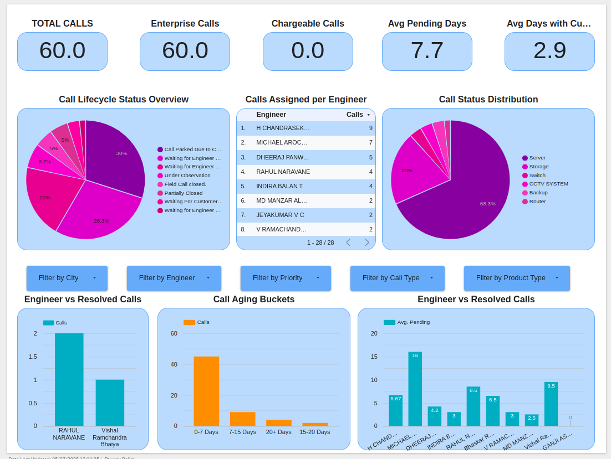

# 📊 Field Support Calls Dashboard 

A data visualization project built to analyze service call data and uncover patterns in complaint volumes, types, and resolution times.

## 🚀 Overview

This dashboard provides actionable insights into:

- Region-wise complaint distribution
- Categorization of complaint types
- Turnaround Time (TAT) and SLA analysis
- Escalation trends and resolution delays

## 🧹 Data Handling

- Cleaned raw Excel data using Python (pandas)
- Standardized complaint categories, service zones, and timestamps
- Derived key metrics like TAT buckets and SLA breach flags

## 📊 Dashboard Features

- Interactive filters (Zone, Product Category, Date)
- Charts for volume trends, escalation rates, and SLA performance
- TAT distribution across complaint types and regions

## 🛠️ Tools Used

- Google Looker Studio
- Python (pandas, matplotlib)
- Excel / CSV as data source

## 📌 Outcome

Empowered internal teams to identify high-issue regions, optimize resource allocation, and improve service delivery.

## 📸 Preview

## 🌐 Live Dashboard

[View Live Looker Dashboard](https://lookerstudio.google.com/reporting/fbc53aa7-e158-4b5a-ae87-7efed7c3bf9d)

