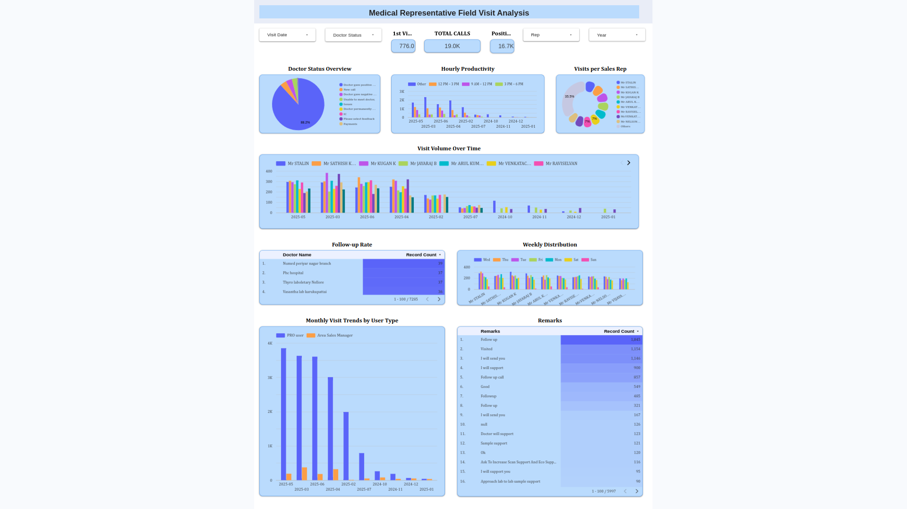
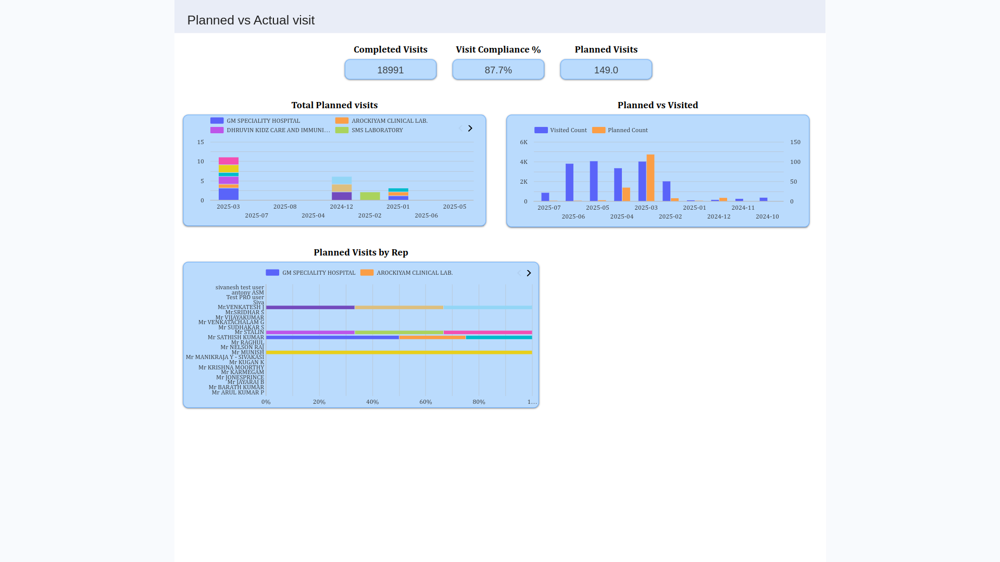

# 👩‍⚕️ Medical Representative Visits Dashboard

An interactive dashboard designed to analyze field visits by medical representatives and compare planned vs actual coverage.

## 🚀 Overview

This dashboard helps track and evaluate:

- Planned vs completed doctor visits
- Rep-level engagement patterns
- Zone-wise and city-wise coverage
- Doctor visit statuses and TAT patterns

## 🧹 Data Handling

- Cleaned and transformed raw field visit logs
- Merged planning and visit data for comparative analysis
- Created filters for rep name, doctor status, and date ranges

## 📊 Dashboard Features

- Interactive drill-downs by rep, city, or doctor
- Donut charts for visit status distribution
- Bar charts for weekly/monthly performance
- Call aging buckets to monitor response delays
- Total calls, enterprise calls, and chargeable call stats
- Engineer-wise performance insights
- City, call type, priority, and product-level filters

## 🛠️ Tools Used

- Google Looker Studio
- Python (pandas)
- CSV files as input

## 📌 Outcome

Helped management monitor rep performance, optimize field coverage, and reduce missed visits.

## 📸 Preview

## 🌐 Live Dashboard

[View Live Looker Dashboard](https://lookerstudio.google.com/reporting/a95bbc20-fd20-417d-b6ad-9f7531782dcf)
